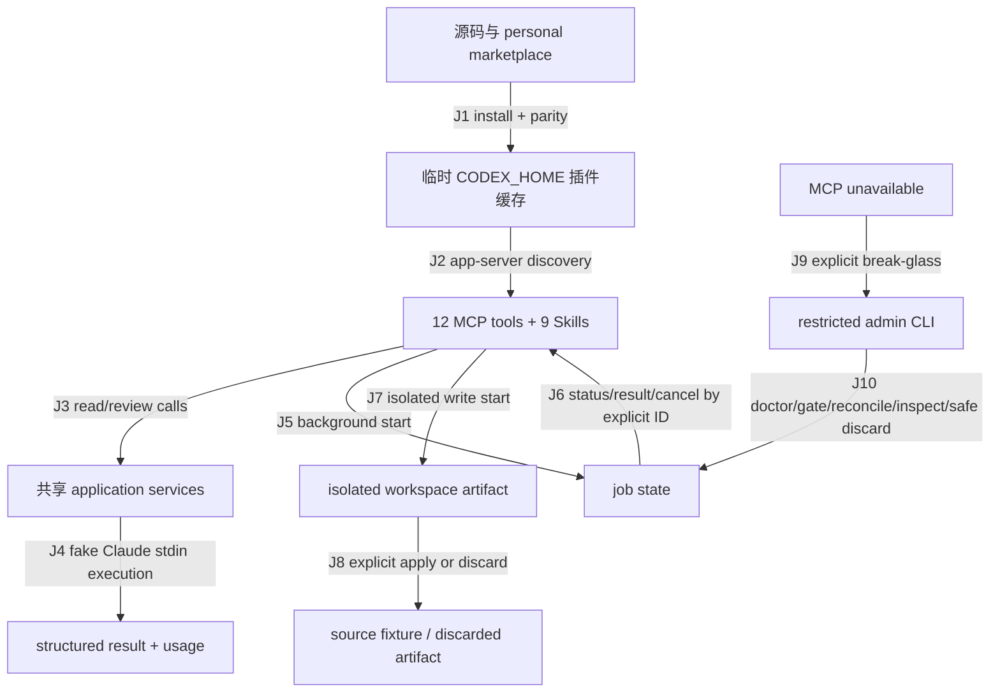

# MCP 主路径与 CLI 收缩端到端测试计划

**Artifact ID**: `2026-07-18-mcp-primary-transport-e2e-test-plan`
**Contract version**: `e2e-plan/v1`
**环境**: local macOS，临时 `CODEX_HOME`、临时 Git workspace、fake Claude
**源码指纹**: commit `a1e95b07b4d9bcf0df989af384b68212c77ae47c`

## 概览

- 覆盖 10 条旅程边、12 个场景；Core Slice 为 `MCP-E2E-001`～`MCP-E2E-008`。
- 最高风险是：安装缓存或 Skill 仍指向旧 normal CLI；host 能发现 MCP 但 review/task/write/job 生命周期实际没有走 typed tools；故障管理面越权启动正常业务或破坏 `partial_apply`。
- `CONDITIONAL`：真实自然语言 Skill 选择与真实 Claude/Fable 模型路由需要消耗外部模型用量，本轮不执行。
- `OUT-OF-SCOPE`：Windows native 证据需要 Windows runner/VM；当前 macOS 本地执行范围不包含该平台。

## 1. 来源清单

| 来源 | 权威内容 | 收据 |
|---|---|---|
| 实施归档 | 唯一正常路径、12 tools、9 Skills、16 host 操作、admin 边界、失败演练与排除项 | `docs/plans/2026-07-17-mcp-primary-cli-contraction-implementation.md:25-37,341-420,432-441` |
| MCP adapter | tool inventory、schema、handler、JSON-RPC 错误映射与 structured output | `mcp/server.mjs:9-40,43-91` |
| admin adapter | admin allowlist、显式 ID、doctor/probe/gate/jobs/artifact 操作 | `scripts/claude-admin.mjs:5-65,79-101` |
| job query service | workspace/global、过滤、cursor、RFC3339、真实闰秒、安全投影 | `scripts/lib/job-query-service.mjs:7-87,89-111` |
| host verifier | 临时安装、source/cache parity、fake runtime、5 sessions、16 operations、write apply/discard | `test/verify-installed-host-routing.mjs:11-64,66-86` |
| criterion verifier | 旧 CLI 删除、admin-only bin、Skill 零 fallback、全量回归与 host 判据 | `test/verify-mcp-cli-contraction.mjs:5-42` |
| MCP contract tests | Fable/model/effort、resume、review kind、write sandbox、参数错误 | `test/mcp-server.test.mjs:32-176` |
| admin failure tests | MCP-down、broken server、stale/corrupt job、`partial_apply` fail closed | `test/admin-cli.test.mjs:24-151` |
| job query tests | bounded pagination、安全投影、严格 timestamp 与 `-32602` | `test/jobs-list.test.mjs:10-57` |
| 早期执行报告 | stale cache、sandbox auth/state、prompt transport、schema dialect、Windows tooling 风险 | `docs/e2e-test/cc-plugin-codex/e2e-install-cache-20260711T065812Z/execution-report.md`; `e2e-run-design-20260711T044401Z/execution-report.md`; `e2e-run-review-token-validation-20260712T164255/execution-report.md` |

### 范围外

- production/preprod、远程 daemon/REST、MCP prompts/resources 产品化。
- 真实付费 Claude/Fable、真实多日流量、真实 Stop gate 模型审查。
- Windows native、非 Codex 正式 standalone CLI。

## 2. 文档-代码语义差异

| Contract | Code behavior | Delta | Risk | Resolution |
|---|---|---|---|---|
| 正常产品面只有 Skills → typed MCP | `package.json` 只暴露 admin bin；旧 companion 文件不存在；Skills 禁止 fallback | match | P0 | `MCP-E2E-001`, `MCP-E2E-008` |
| MCP inventory 为 12 tools | `mcp/server.mjs:13-25` 定义 12 tools | match | P0 | `MCP-E2E-001` |
| 9 Skills 可被 fresh host 发现 | host verifier 调用 `skills/list` 并断言 9 | match | P1 | `MCP-E2E-001` |
| 5 fresh sessions 完成至少 10 次正常操作 | verifier 固定 5 sessions、当前 16 operations | match | P0 | `MCP-E2E-002`～`MCP-E2E-005` |
| model（含 Fable）和 effort 可透传 | MCP schema 接受任意非空 model 与三档 effort；contract tests 验证 argv/metadata | E2E host verifier 尚未捕获 installed-host argv | P1 | `MCP-E2E-009`; installed-host 强化列为 `CONDITIONAL` 缺口 |
| “发现 Skill”代表自然语言请求会使用正确 Skill | verifier 只发现 Skill，正常操作直接调用 MCP tool | coverage delta，不是已证明的产品缺陷 | P1 | `MCP-E2E-011`，本轮 `CONDITIONAL` |
| admin 在 MCP-down 时可恢复但不能执行正常业务/apply | admin allowlist 与 failure fixtures 符合 | match | P0 | `MCP-E2E-006`, `MCP-E2E-010` |

## 3. 业务流与旅程图

### Journey Graph

| 边 | 消费 | 产出 | 状态/副作用 | 来源 |
|---|---|---|---|---|
| J1 | source root、marketplace | `plugin_root`, `cache_version` | 临时 cache 写入；用户 cache 只读比对 | host verifier 16-29 |
| J2 | `plugin_root`, workspace | `tool_inventory`, `skill_inventory`, `thread_id` | 5 个 ephemeral app-server sessions | host verifier 66-81 |
| J3 | explicit MCP args | review/task structured payload | source workspace 只读 | MCP server 13-17,28-32 |
| J4 | prompt、model/effort/profile | result、usage、effective models | fake runtime，无付费网络调用 | host verifier 34-52 |
| J5 | background request | `job_id` | 临时 state 新 job | host verifier 57-58 |
| J6 | explicit `job_id` | terminal job/result/cancel state | job 状态转换；无 implicit latest | MCP server 21-24 |
| J7 | authorized write task | isolated clone、artifact | 不自动修改 source | MCP server 18; host verifier 59-61 |
| J8 | explicit `job_id` | `applied` 或 `discarded` | 专用 fixture 文件写入或隔离目录丢弃 | host verifier 59-61 |
| J9 | broken/missing MCP | admin invocation | 只允许 break-glass surface | admin tests 32-97 |
| J10 | explicit action/ID | doctor/gate/job/artifact state | 临时 config/state；`partial_apply` fail closed | admin tests 99-137 |

## 4. Agent 执行契约

- **目标面**: `node test/verify-installed-host-routing.mjs`、`node test/verify-mcp-cli-contraction.mjs`、Node test runner；均为仓库声明的 adapter（已确认）。
- **测试数据**: verifier 自建 `cc-plugin-host-verifier-*` 临时根、临时 Git workspace、临时 `CODEX_HOME`、fake Claude、临时 state/write/config 根（已确认）。
- **变量传递**: `source_commit` → `cache_version/plugin_root` → `thread_id` → `job_id/artifact_status` → `criterion`; 所有 job 操作消费显式 ID。
- **探针/Oracle**: host verifier 最终 JSON；Node TAP；criterion 唯一成功标记；source/temp install/user cache 文件内容相等；source fixture `agent-output.txt`；JSON-RPC codes。
- **等待/预算**: host request 15s；job wait 12s、40ms polling；criterion 120s；执行器整轮 180s。无性能 SLA，不能把耗时趋势写成性能 verdict。
- **隔离/清理**: 默认 preserve traces；owner prefix `cc-plugin-host-verifier-*`/各测试 prefix；TTL 7 天。只在用户明确要求时清理：`find "${TMPDIR%/}" -maxdepth 1 -type d -name 'cc-plugin-host-verifier-*' -mtime +7 -exec rm -rf -- {} +`。仓库计划/报告文件保留。
- **阻塞/缺口**: 自然语言 Skill 选择需要 Codex agent turn 与模型用量；真实 Fable/Claude 需要付费授权；Windows 需要 runner/VM。Core Slice 不依赖三者。

### 所需能力

| 能力 | 类型 | 状态 |
|---|---|---|
| Node `>=18`、Git、Codex app-server | required | 已确认；执行器须重新探测路径/版本 |
| personal marketplace 本地 root | required | 待验证：executor 运行时 probe |
| 临时 `CODEX_HOME` 安装权限 | required | 待验证：executor 运行时 probe |
| 本机当前版本 cache 只读 | required | 待验证：executor 核对 `0.1.0+codex.20260718001845` |
| fake Claude sandbox manifest 注入 | required | 已确认：project adapter 内置 |
| 真实 Claude/Fable 认证与模型额度 | optional | 本轮禁止 |
| Windows runner/VM | optional | 阻塞 |

## 5. 风险图

| 风险族 | 失败形态 | 覆盖 |
|---|---|---|
| 部署新鲜度 | source、临时安装或用户 cache 版本漂移 | 001 |
| 路由正确性 | review 走 task、adversarial 复用普通 review、Skill fallback CLI | 001,002,008,011 |
| 生命周期 | background 无法完成/result/cancel 或使用 implicit latest | 003,004,007 |
| 写隔离 | 自动 apply、discard/apply 混淆、source 未验证写入 | 005,010 |
| 故障管理权限 | MCP-down 后 admin 越权启动 task/review/apply | 006,010 |
| 参数/数据安全 | cursor/timestamp 接受错误、job 投影泄漏 prompt/disclosure | 007 |
| 配置/模型语义 | Fable/model/effort 丢失或 effective model 伪造 | 009 |
| 恢复 | corrupt state 被覆盖、`partial_apply` 被自动 discard | 010 |
| 兼容/平台 | Windows process/path 行为未验证 | 012 |

性能与并发：来源没有端到端吞吐或延迟阈值；不创建无 Oracle 的性能场景。多个 job 的并发隔离已有下层测试，但当前 host adapter 没有并发场景，记录为 `CONDITIONAL` 缺口。

## 6. 场景总览

| 场景 | 分组 | Priority | 切片 | 风险/目的 | Probe/Oracle | Edges | 通道 | Side-effect Class | 数据策略 | 关联 Issue |
|---|---|---|---|---|---|---|---|---|---|---|
| MCP-E2E-001 安装、缓存与 inventory | deployment | P0 | Core Slice | 新鲜安装且唯一入口正确 | source/temp/user parity；12 tools、9 Skills、无旧 CLI | J1,J2 | local-service | external-file | preserve 7d | none |
| MCP-E2E-002 read/review 路由 | routing | P0 | Core Slice | 四类只读能力经 dedicated tools | code/plan/adversarial/task 全部返回正确 kind/result | J3,J4 | RPC | additive-retained | temp only | none |
| MCP-E2E-003 background result | lifecycle | P0 | Core Slice | 异步成功链 | start→completed→result=`host-ok` | J5,J6 | RPC/job | additive-retained | preserve 7d | none |
| MCP-E2E-004 explicit cancel | lifecycle | P0 | Core Slice | 显式 ID 取消 | running→cancelled；无 implicit latest | J5,J6 | RPC/job | additive-retained | preserve 7d | none |
| MCP-E2E-005 isolated write apply/discard | write | P0 | Core Slice | 写隔离与显式决策 | awaiting_apply→discarded/applied；source marker 仅 apply 后出现 | J7,J8 | RPC/job/git | additive-retained | dedicated fixture | none |
| MCP-E2E-006 MCP-down admin boundary | recovery | P0 | Core Slice | 管理面独立且不越权 | broken MCP 下 gate 可用；review/task/apply/result 均拒绝 | J9,J10 | CLI | config-change | dedicated temp config | none |
| MCP-E2E-007 jobs query/error contract | data safety | P1 | Core Slice | bounded、安全投影和参数错误 | cursor 稳定；无 prompt/disclosure；invalid→`-32602` | J5,J6 | RPC | additive-retained | dedicated temp state | none |
| MCP-E2E-008 aggregate zero-legacy gate | migration | P0 | Core Slice | 完整回归且零旧入口/fallback | criterion complete；99 tests；legacy=false/fallback=0 | J1-J10 | local-service | external-file | preserve reports | none |
| MCP-E2E-009 Fable/model/effort contract | config | P1 | Extended Slice | 显式参数原样透传并区分 requested/effective | contract tests 检查 argv 与 metadata | J3,J4 | RPC/contract | additive-retained | temp only | none |
| MCP-E2E-010 corrupt/partial_apply recovery | recovery | P0 | Extended Slice | 人工恢复边界 fail closed | corrupt 原记录保留；partial inspect 可见且 discard 拒绝 | J9,J10 | CLI/job | additive-retained | dedicated fixture | none |
| MCP-E2E-011 自然语言 Skill 选择 | routing | P1 | Hazardous/Defer | 证明用户意图实际选择正确 Skill/tool | fresh Codex turn 捕获 tool name；不得只看 skills/list | J2,J3 | agent/RPC | additive-retained | needs usage approval | future executor issue |
| MCP-E2E-012 Windows native | platform | P1 | blocked | 验证 `.cmd`、CRLF、process tree | Windows runner 上同 Core Slice 关键子集 | J1-J8 | local-service | external-file | dedicated runner | none |

## 7. Core 场景卡

### MCP-E2E-001 安装、缓存与 inventory
- Index: node `N1` | priority P0 | Side-effect Class `external-file` | readiness gate → G1-G4
- **目的**: 防止 stale cache、旧 CLI 或不完整 inventory 被当成新版本。
- **来源**: host verifier 16-29,66-70；实施归档 345-359。
- **覆盖边**: J1,J2。
- **准备**: source commit `a1e95b0`；personal marketplace；用户 cache version `0.1.0+codex.20260718001845`。
- **步骤和依赖**: 建临时 `CODEX_HOME` → 安装 marketplace/plugin → 比对 source/temp/user cache → fresh app-server discovery。
- **期望**: 12 tools、9 prefixed Skills；关键树/manifest/admin/package 相等；两处均无 `scripts/claude-companion.mjs`。
- **自动化级别**: E2E。
- **隔离/清理**: 临时安装，保留 7 天；不修改用户 cache。

### MCP-E2E-002 read/review 路由
- Index: node `N2` | priority P0 | Side-effect Class `additive-retained` | readiness gate → G5
- **目的**: code/plan/adversarial/task 不能互相错误路由。
- **来源**: host verifier 54-56；MCP tools 14-17,28-32。
- **覆盖边**: J3,J4。
- **准备**: `N1` 产出的 installed plugin、workspace、fake runtime。
- **步骤和依赖**: 两个 fresh sessions 调用四个 dedicated tools。
- **期望**: `review_kind=code|plan|adversarial`；readonly task `result=host-ok`；source diff 保持只读。
- **自动化级别**: E2E。
- **隔离/清理**: job/session 仅临时 state，preserve 7d。

### MCP-E2E-003 background result
- Index: node `N3` | priority P0 | Side-effect Class `additive-retained` | readiness gate → G5
- **目的**: 证明 background job 可由显式 ID 完成并取回结果。
- **来源**: host verifier 57,76。
- **覆盖边**: J5,J6。
- **准备**: `N1` fixtures。
- **步骤和依赖**: start(background) 产出 `job_id` → bounded poll → result。
- **期望**: terminal `completed`；result `host-ok`；所有调用使用同一显式 ID。
- **自动化级别**: E2E。
- **隔离/清理**: 临时 state，preserve 7d。

### MCP-E2E-004 explicit cancel
- Index: node `N4` | priority P0 | Side-effect Class `additive-retained` | readiness gate → G5
- **目的**: 取消不依赖 implicit latest，且不会误报完成。
- **来源**: host verifier 39,58。
- **覆盖边**: J5,J6。
- **准备**: dedicated long-running fake marker。
- **步骤和依赖**: start → wait running → cancel(`job_id`)。
- **期望**: `status=cancelled`；目标为产出的 ID。
- **自动化级别**: chaos/recovery。
- **隔离/清理**: 独立 job，不与 N3 并发。

### MCP-E2E-005 isolated write apply/discard
- Index: node `N5` | priority P0 | Side-effect Class `additive-retained` | readiness gate → G5
- **目的**: 写任务只在隔离 workspace 产生 artifact，并由显式 apply/discard 决定。
- **来源**: host verifier 40,59-62；实施不变量 378-395。
- **覆盖边**: J7,J8。
- **准备**: dedicated Git fixture；verified fake sandbox manifest。
- **步骤和依赖**: write A→awaiting_apply→discard；write B→awaiting_apply→apply→读 source marker。
- **期望**: A=`discarded` 且 source 无 marker；B=`applied` 且 `agent-output.txt` 精确为 `host-routed write\n`；绝不自动 apply。
- **自动化级别**: E2E。
- **隔离/清理**: dedicated fixture；串行、preserve 7d。

### MCP-E2E-006 MCP-down admin boundary
- Index: node `N6` | priority P0 | Side-effect Class `config-change` | readiness gate → G6
- **目的**: MCP 故障时恢复面仍可用，但不能成为第二正常产品面。
- **来源**: admin tests 24-97；admin adapter 5-65。
- **覆盖边**: J9,J10。
- **准备**: missing/broken MCP fixture、临时 config root。
- **步骤和依赖**: 拒绝 normal commands → doctor missing manifest → broken probe → gate enable/status/disable。
- **期望**: normal commands exit 1；doctor/probe 给结构化诊断；broken server 不影响 gate；最终 gate 恢复 disabled。
- **自动化级别**: chaos/recovery。
- **隔离/清理**: dedicated temp config，测试内恢复 gate；preserve evidence。

### MCP-E2E-007 jobs query/error contract
- Index: node `N7` | priority P1 | Side-effect Class `additive-retained` | readiness gate → G6
- **目的**: history 查询有界且不泄露输入，坏参数区分为 client error。
- **来源**: jobs tests 10-57；query service 13-87。
- **覆盖边**: J5,J6。
- **准备**: seeded temp jobs（含 e2e 与 disclosure）。
- **步骤和依赖**: limit=1 分页 → cursor 下一页 → malformed cursor/timestamps → real leap seconds。
- **期望**: 排序稳定；默认隐藏 e2e；无 prompt/disclosure；坏参数 `-32602`；真实闰秒 Z/offset 通过，伪造/`-00:00` 拒绝。
- **自动化级别**: API integration。
- **隔离/清理**: temp state，preserve 7d。

### MCP-E2E-008 aggregate zero-legacy gate
- Index: node `N8` | priority P0 | Side-effect Class `external-file` | readiness gate → G1-G6
- **目的**: 用单一 criterion 汇总产品、发布面与 host E2E。
- **来源**: criterion verifier 5-42。
- **覆盖边**: J1-J10。
- **准备**: Core 独立运行通过；本机安装 cache 与 source 版本一致。
- **步骤和依赖**: 执行 `node test/verify-mcp-cli-contraction.mjs`。
- **期望**: exit 0；唯一标记 `TASKLOOP_CRITERION: mcp-cli-contraction-complete`；内部全量测试与 host verifier 通过。
- **自动化级别**: E2E regression gate。
- **隔离/清理**: temp installs/jobs preserved；不清理用户 cache。

## 8. Execution DAG

| 节点 | 场景 | 依赖 | 消费 | 产出 | 所需能力 | 副作用范围 | 隔离键 | 并行安全 | 清理依赖 | 扰动标记 |
|---|---|---|---|---|---|---|---|---|---|---|
| N1 | 001 | none | source commit/cache version | plugin_root, workspace, inventories | codex/plugin/git | temp install/workspace | host-verifier root | unsafe：统一 fixture root | plugin_root | none |
| N2 | 002 | N1/J1-J2 | plugin_root, workspace | review/task evidence | app-server/MCP/fake | temp jobs | session IDs | safe within adapter-defined sessions | N1 | none |
| N3 | 003 | N1/J2 | workspace | completed_job_id,result | MCP/job | temp state | job ID | safe vs N2；adapter 串行 | N1 | none |
| N4 | 004 | N1/J2 | workspace | cancelled_job_id | MCP/job/process | temp state/process | job ID | unsafe：long process isolated | N1 | recovery |
| N5 | 005 | N1/J2 | workspace | discard/apply IDs,marker | MCP/git/sandbox | isolated/source fixture | job ID | unsafe：修改 fixture | N1 | recovery |
| N6 | 006 | none | broken MCP fixtures | admin evidence | Node CLI | temp config/state | test tmp root | safe vs host verifier | fixture root | recovery |
| N7 | 007 | none | seeded jobs | cursor/error evidence | Node/MCP | temp state | test tmp root | safe vs N6 | fixture root | none |
| N8 | 008 | N1-N7 | repository/cache | criterion | Node/Codex | new temp roots | criterion run | unsafe：内部再跑全套 | internal | none |
| N9 | 009 | none | MCP fixtures | argv/metadata evidence | Node/MCP | temp files | test tmp root | safe | fixture root | none |
| N10 | 010 | none | corrupt/partial fixtures | recovery evidence | Node/admin | temp state | test tmp root | safe | fixture root | recovery |
| N11 | 011 | N1 | natural-language intent | selected Skill/tool trace | Codex agent model | model usage/thread | thread ID | unknown：需额度授权 | thread | none |
| N12 | 012 | none | source | Windows evidence | Windows runner | runner workspace | run ID | unknown：无能力 | runner | none |

## 执行器交接索引

- **Artifact ID**: `2026-07-18-mcp-primary-transport-e2e-test-plan`
- **Contract version**: `e2e-plan/v1`
- **Plan source**: implementation commit `a1e95b0`; sources in §1；真实 Skill/model 路由为未验证缺口。
- **Scenario set**: Core `001-008`; Extended `009-010`; deferred `011`; blocked `012`。
- **DAG nodes**: roots `N1,N6,N7,N9,N10,N12`; disruptive `N4,N5,N6,N10`。
- **Variable ledger**: `N1` 产出 plugin/workspace；`N3-N5` 各自产出显式 job IDs；`N8` 只消费 repository/cache contract，不复用旧 job。
- **Required capabilities**: Node/Git/Codex/personal marketplace/temp install/user-cache read/fake runtime；无真实模型依赖。
- **Data policy anchors**: preserve traces，prefix owner，TTL 7d；清理仅在明确授权后执行，命令见 §4。
- **Execution blockers**: N11 需模型用量授权与 agent-turn trace；N12 缺 Windows runner。

## 9. 覆盖矩阵

| 需求/风险 | 场景 |
|---|---|
| 唯一正常 MCP 路径、admin-only bin | 001,006,008 |
| 12 tools / 9 Skills discovery | 001 |
| dedicated code/plan/adversarial/task routing | 002,011 |
| background status/result/cancel | 003,004 |
| isolated write + explicit apply/discard | 005,010 |
| MCP-down doctor/gate/recovery | 006,010 |
| bounded jobs、安全投影、错误码 | 007 |
| Fable/model/effort/requested-vs-effective | 009 |
| source/install/user-cache parity、零 fallback | 001,008 |
| cross-platform | 012 |

## 10. 缺口、假设与问题

| ID | Disposition | 内容 | 处理 |
|---|---|---|---|
| GAP-01 | CONDITIONAL | host verifier 发现 Skills，但直接调用 MCP tool，未证明自然语言 router 选择 | 只有明确允许 Codex agent 用量后执行 011；不得以 001/002 冒充 |
| GAP-02 | CONDITIONAL | installed-host verifier 未记录 Fable/model/effort 的最终 argv | 本轮以 009 contract 证据覆盖；后续若要求 host-level parity，需单独授权扩展 verifier 测试代码 |
| GAP-03 | OUT-OF-SCOPE | 真实 Claude/Fable 与实际费用/模型路由 | 本轮 fake runtime；报告必须明确未验证 |
| GAP-04 | OUT-OF-SCOPE | 本轮为 macOS local run，且无 Windows runner/VM | 012 不执行，不影响 macOS Core verdict |
| GAP-05 | CONDITIONAL | 无来源定义 E2E 性能阈值；host 并发 job adapter 未实现 | 不生成伪性能 verdict；取得阈值/adapter 后立计划增量 |
| GAP-06 | ACCEPTED | preserve traces 会留下临时目录 | TTL 7d；不自动 destructive cleanup |

## 11. Agent 就绪门禁

- **G1**: `node`, `git`, `codex` 路径和版本解析为具体值。
- **G2**: source commit 与 plugin build version 记录；工作区产品代码与该 commit 一致。
- **G3**: personal marketplace 可列出，临时 `CODEX_HOME` 可写。
- **G4**: 用户 cache `0.1.0+codex.20260718001845` 可读；source/cache freshness 由 verifier 再证实。
- **G5**: fake executable 只注入临时安装副本 `.mcp.json`，sandbox compatibility hash 匹配；真实 Claude 不得被调用。
- **G6**: admin/job fixtures 使用专属 temp config/state；不得操作真实用户 jobs/gate。

退出标准（default unless overridden）：所有 Core 场景 `passed`，无 `OPEN` actionable defect；N11/N12 按既定 disposition 报告，不得算作 Core 失败。任一 adapter 返回非零时保留现场、停止依赖节点并分类。

## 12. 场景切片

- **Core Slice**: 001-008；关闭安装、路由、生命周期、写隔离、故障管理、job safety 和零旧入口的主风险。
- **Extended Slice**: 009-010；利用现有 contract/recovery fixtures 补齐 Fable/effort 与极端恢复边界。
- **Hazardous/Defer**: 011；需要 Codex agent 模型用量与可观测 tool trace。
- **blocked**: 012；需要 Windows runner/VM。

## 13. 执行顺序

1. preflight G1-G6。
2. 并行运行 N6、N7、N9、N10；同时独占运行 N1→N2→N3→N4→N5。
3. 独占运行 N8 作为新鲜 aggregate gate。
4. 记录 N11/N12 的既定 disposition，不触发真实模型或不存在的平台。
5. 生成 `execution-report.md`；默认保留临时痕迹。
