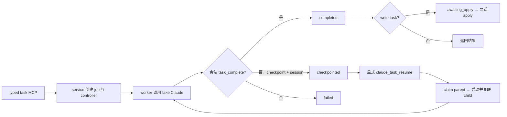

# Task Execution Lease 增量 E2E 测试计划

**状态：** 可执行
**日期：** 2026-07-18
**类型：** Delta Plan
**被测对象：** 已安装的 `cc-plugin-codex` 插件缓存
**外部调用：** 禁止真实 Claude/Fable 调用；统一使用仓库内 fake Claude 驱动

## 1. 目标与判定标准

验证 Task Execution Lease 是否解决同一个根问题：任务撞到 turn、cost 或 timeout 边界时，不应自动重跑并重复消耗；只有可信进度可成为显式可恢复检查点，写任务还必须保持原隔离工作区和显式 apply 边界。

通过标准：

1. 已安装插件与当前源码关键文件一致，并暴露 `claude_task_resume`。
2. turn/cost breaker 仅在同时存在合法 checkpoint 和 Claude session 时产生 `checkpointed`，单次启动只调用 fake Claude 一次。
3. 只有显式 `claude_task_resume(job_id)` 才继续；父任务先被原子 claim，最多关联一个 child，并累计链路成本。
4. 写任务 checkpoint 时不可 apply；resume 复用同一已验证隔离工作区，完成后才进入 `awaiting_apply`，显式 apply 后才修改源码工作区。
5. 缺失/损坏 receipt、重复 resume、源码或 sandbox 身份漂移、cancel、timeout、陈旧 claim 均 fail closed 或按设计恢复。
6. feature flag 默认关闭；聚焦测试和全量回归无失败。

## 2. 来源清单

| 来源 | 已确认语义 | E2E 约束 |
|---|---|---|
| `docs/plans/2026-07-18-task-execution-lease-implementation.md` | 状态机、completion reserve、显式 resume、写隔离不变量 | 定义验收语义 |
| `mcp/server.mjs` | 注册 `claude_task_resume` 并路由到 `resumeTask` | 从公开 MCP stdio 边界发起 |
| `scripts/lib/service.mjs` | 继承 session/model/effort/预算、claim-before-child、写 sandbox 重验 | 检查继承、串行化与隔离身份 |
| `scripts/claude-job-worker.mjs` | 校验 receipt 并投影 completed/checkpointed/failed | 检查 breaker 和成功退出终态 |
| `scripts/lib/task-execution-lease.mjs` | checkpoint 投影、resume eligibility、child linkage、累计成本 | 检查状态和重复 resume |
| `scripts/lib/task-execution-runtime.mjs` | job-local controller 生命周期和状态校验 | 检查 receipt 损坏与清理 |
| `scripts/lib/job-lifecycle.mjs` | stale claim 恢复、cancel/timeout 清理 | 检查生命周期收敛 |
| `scripts/lib/patch-artifact.mjs` | 仅 `completed + awaiting_apply` 可 apply | checkpoint 必须不可应用 |
| `scripts/lib/write-workspace.mjs`、`sandbox-policy.mjs` | 独立 clone、canonical path、策略和可执行文件身份 | 写 resume 必须复用并重验 sandbox |
| `scripts/lib/config.mjs` | `executionLeaseEnabled` 默认 `false` | 检查默认关闭和显式开启 |
| `test/task-execution-lease.test.mjs` | MCP → service → worker → controller → fake Claude → state/resume/apply | 主 E2E 驱动，不另造实现 |
| `test/task-execution-controller.test.mjs` | 只暴露两种 bounded receipt | 控制面契约门禁 |
| `test/verify-task-execution-lease.mjs` | 关键断言、聚焦测试和全量套件 | 最终回归门禁 |

## 3. 文档—代码语义差异

| 计划语义 | 当前代码 | 结论 |
|---|---|---|
| feature flag 默认关闭 | config 默认 `false` | 一致；E2E 显式开启 |
| 一个 typed resume 工具 | MCP 注册 `claude_task_resume` | 一致 |
| checkpoint 需要 receipt + session | worker 与 projector 均检查 | 一致；覆盖缺一失败 |
| resume 先 claim 后启动 child | service 先 `claimTaskResume` | 一致；覆盖重复/stale claim |
| 写 resume 复用并重验 sandbox | service 校验 backend、policy、Claude hash 与路径 | 一致；覆盖源码漂移 |
| checkpoint 不可 apply | apply 仅允许 completed + awaiting_apply | 一致 |
| 不自动重试/扩预算 | 无自动 resume 或预算提升 | 一致；用调用次数证明 |

没有阻断执行的文档—代码冲突。

## 4. 业务链路



## 5. 执行契约

### 5.1 环境门禁

- 本机 macOS；写隔离场景只在 Darwin 执行。
- 系统 Node.js 与 Git 可用。
- 被测版本为 `$HOME/.codex/plugins/cache/personal/cc-plugin-codex/` 下最新安装目录。
- `mcp/server.mjs`、`scripts/lib/service.mjs`、`scripts/lib/task-execution-lease.mjs` 与源码 SHA-256 一致。
- installed cache 的 `mcp probe --json` 成功并含 `claude_task_resume`。
- 使用独立 `TMPDIR`；不得使用真实 Claude 凭据或网络。
- 执行前后记录源码工作区 `git status --short`，不得清理既有改动。

任一门禁失败即停止业务场景并报告 `BLOCKED`，不得修改被测代码绕过。

### 5.2 证据与保留

- 每个场景保留命令、原始输出、退出码、匹配测试名和 TAP 计数。
- fixture 写入独立 `TMPDIR`，默认保留 7 天。
- 报告必须给出 re-query 命令。
- 报告交付前不清理；清理命令为 `rm -rf "$E2E_TMPDIR"`。

### 5.3 Stop 条件

- installed cache 哈希不一致；
- MCP probe 失败或缺少 resume 工具；
- 出现真实网络/付费调用、非预期源码修改或失控后台进程；
- 写场景无法证明 checkpoint 前源码未变；
- 测试失败且根因未知。

## 6. 场景清单

| ID | 场景 | 级别 | 依赖 | 主要证明 |
|---|---|---|---|---|
| TEL-E2E-001 | 安装新鲜度、配置与 MCP inventory | Core | 无 | 被测对象和入口正确 |
| TEL-E2E-002 | readonly turn breaker 形成 checkpoint | Core | 001 | 单次调用、checkpoint、前后台一致 |
| TEL-E2E-003 | readonly 显式 resume 完成 cost chain | Core | 002 | 同 session、一个 child、累计成本 |
| TEL-E2E-004 | cost breaker 不自动 retry | Core | 001 | checkpoint 且只调用一次 |
| TEL-E2E-005 | write checkpoint → same sandbox resume → apply | Core/macOS | 001 | checkpoint 不可 apply，最后显式应用 |
| TEL-E2E-006 | receipt/controller/session 异常 fail closed | Core | 001 | 不产生错误 resumable 状态 |
| TEL-E2E-007 | duplicate/stale claim、cancel、timeout、write drift | Core | 002、005 | 竞态与生命周期安全收敛 |
| TEL-E2E-008 | installed-cache 聚焦套件与全量回归 | Core | 002–007 | 新链路与全仓 0 fail |
| TEL-E2E-009 | 默认关闭与旧 resume 兼容 | Extended | 001 | rollout 不改变旧默认 |

## 7. Core 场景卡

### TEL-E2E-001：环境与公开入口

- **Act：** 比较关键文件哈希；运行 installed MCP probe；运行 controller contract test。
- **Assert：** 哈希一致；inventory 含 resume；controller 只暴露 `task_checkpoint`、`task_complete`，有 remaining gap 时拒绝 complete。
- **证据：** 哈希、probe JSON、TAP。

### TEL-E2E-002：turn breaker checkpoint

- **Act：** fake Claude 发布 checkpoint/session 后返回 max-turn，分别走前台和后台 readonly。
- **Assert：** job/result 为 `checkpointed`；receipt、session、usage/cost 存在；可 resume、无 child；每个启动只调用一次。
- **证据：** 匹配 `turn breaker` 与 `foreground readonly` 的 TAP。

### TEL-E2E-003：显式 readonly resume

- **Act：** 对 checkpoint parent 调用 `claude_task_resume`，fake Claude 在同 session 发布 completion。
- **Assert：** parent 先 claim，只关联一个 child；child completed；parent 不可再 resume；累计成本正确。
- **证据：** 匹配 `resumes one checkpoint explicitly` 的 TAP。

### TEL-E2E-004：cost breaker

- **Act：** fake Claude 发布 checkpoint 后返回 max-budget，不调用 resume。
- **Assert：** `checkpointed`、`cost_budget_exhausted=true`，调用数 1，无自动 child。
- **证据：** 匹配 `cost breaker` 的 TAP。

### TEL-E2E-005：隔离写续跑与 apply

- **Act：** 首次只在隔离 clone 写入并 checkpoint；尝试 apply；显式 resume；最后显式 apply。
- **Assert：** checkpoint 时 apply 被拒且源码未变；resume 复用原 identity；child 完成后 `awaiting_apply`；apply 后源码才正确改变。
- **证据：** 匹配 `isolated write checkpoint cannot apply` 的 TAP 和 fixture 状态。

### TEL-E2E-006：无可信 receipt 时失败关闭

- **Act：** 分别构造成功退出无 receipt、breaker 无 checkpoint/session、controller state 损坏。
- **Assert：** 均 `failed`，错误分类稳定，无 resume eligibility/artifact。
- **证据：** 三个对应测试的 TAP。

### TEL-E2E-007：恢复与竞态

- **Act：** 构造 stale unlinked claim、重复 resume、cancel、timeout、源码漂移和 stale write claim。
- **Assert：** stale claim 回滚或链接 child；重复 resume 被拒；cancel/timeout 清理 controller；write drift 拒绝 resume；write claim 可显式 discard 且不触碰源码。
- **证据：** 对应测试 TAP。

### TEL-E2E-008：回归门禁

- **Act：** 在 installed cache 运行两个聚焦文件、verifier 和全量检查。
- **Assert：** 聚焦 16/16；verifier 达成 criterion；全量当前总数 0 fail（预期 137/137）。
- **证据：** 原始 TAP 汇总与 verifier 输出；总数变化需解释。

## 8. 执行 DAG

```text
001
 ├─ 002 ─ 003
 ├─ 004
 ├─ 005
 └─ 006
002 + 005 ─ 007
002..007 ─ 008
001 ─ 009 (extended)
```

最小首切片为 001 → 002 → 003，先证明“撞限制不重跑、显式续跑不重复探索”。失败即停止，不进入写场景。

## 9. Executor Handoff Index

### Setup

```sh
export PLUGIN_SOURCE="$(pwd)"
export PLUGIN_INSTALLED="$(find "$HOME/.codex/plugins/cache/personal/cc-plugin-codex" -mindepth 1 -maxdepth 1 -type d | sort | tail -1)"
export E2E_TMPDIR="$(mktemp -d "${TMPDIR:-/tmp}/cc-plugin-codex-task-lease-e2e.XXXXXX")"
export TMPDIR="$E2E_TMPDIR"
test -n "$PLUGIN_INSTALLED" && test -d "$PLUGIN_INSTALLED"
```

### Environment gate

```sh
node --version
git --version
git -C "$PLUGIN_SOURCE" status --short
for file in mcp/server.mjs scripts/lib/service.mjs scripts/lib/task-execution-lease.mjs; do
  test "$(shasum -a 256 "$PLUGIN_SOURCE/$file" | cut -d' ' -f1)" = "$(shasum -a 256 "$PLUGIN_INSTALLED/$file" | cut -d' ' -f1)"
done
(cd "$PLUGIN_INSTALLED" && node scripts/claude-admin.mjs mcp probe --json)
```

### Scenario commands

```sh
cd "$PLUGIN_INSTALLED"
node --test test/task-execution-controller.test.mjs
node --test --test-name-pattern='turn breaker|foreground readonly' test/task-execution-lease.test.mjs
node --test --test-name-pattern='resumes one checkpoint explicitly' test/task-execution-lease.test.mjs
node --test --test-name-pattern='cost breaker' test/task-execution-lease.test.mjs
node --test --test-name-pattern='isolated write checkpoint cannot apply' test/task-execution-lease.test.mjs
node --test --test-name-pattern='without any receipt|without a checkpoint or session|corrupt task controller' test/task-execution-lease.test.mjs
node --test --test-name-pattern='stale unlinked|cancelling a leased|timing out a leased|source drift' test/task-execution-lease.test.mjs
node --test test/task-execution-controller.test.mjs test/task-execution-lease.test.mjs
node test/verify-task-execution-lease.mjs
node scripts/check.mjs
```

### Re-query 与 Cleanup

- 单场景：重复对应 `--test-name-pattern` 命令。
- inventory：`(cd "$PLUGIN_INSTALLED" && node scripts/claude-admin.mjs mcp probe --json)`。
- 保留数据：`find "$E2E_TMPDIR" -maxdepth 3 -print | sort`。
- 污染检查：`git -C "$PLUGIN_SOURCE" status --short`。
- 报告交付前不清理；之后可执行 `rm -rf "$E2E_TMPDIR"`。

## 10. 覆盖矩阵与缺口

| 需求/风险 | 场景 |
|---|---|
| breaker 后不自动重复消耗 | 002、004 |
| 显式 resume、同 session、累计成本 | 003 |
| 单 parent 仅一个 child | 003、007 |
| receipt 可信 | 001、002、006 |
| 写 sandbox 不被绕过、未完成不可 apply | 005、007 |
| stale claim/cancel/timeout 收敛 | 007 |
| installed cache 新鲜且全仓兼容 | 001、008、009 |

已知缺口及处置：

- 不调用真实 Claude/Fable：fake Claude 覆盖协议、session、usage、cost 和 breaker；真实付费 smoke 单列，不属于本轮。
- 仅 macOS 验证原生写 sandbox：Linux/Windows 另建平台计划。
- 无性能来源阈值：不虚构 SLA，只记录耗时。
- 既有 dirty worktree：执行前后比较，不清理用户改动。
- verifier 成功码可能非 0：按其源码契约和输出判断，并记录实际退出码。

## 11. Agent-ready 门禁

- [x] Core 场景有命令、断言、依赖和停止条件。
- [x] 被测对象是 installed cache，不只是源码目录。
- [x] 禁止真实付费调用。
- [x] 写路径证明 checkpoint 不可 apply、显式 apply 后才改源码。
- [x] 证据保留、复查和清理契约完整。
- [x] 无未决 blocker。
