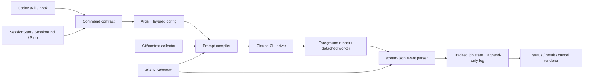

# cc-plugin-codex 产品化执行计划

**模式**: Plan  
**深度**: Deep  
**状态**: in-progress（切片 0–5 已落地；切片 6 的安装态/真实 E2E 证据待补）  
**输入来源**: 本仓库源码与 21 项测试；`DESIGN.md`；`openai/codex-plugin-cc` main@`db52e28`；Claude Code 2.1.207 CLI 实测；Claude Code headless/CLI 官方文档  
**目标**: 在保留 CLI-first 架构的前提下，把当前可运行 MVP 提升为状态可信、权限明确、prompt 可演进、可观测、可发布的 Codex 插件。

## TL;DR

> 执行记录（2026-07-11）：本仓库已实现失败夹具、可信后台终态、版本化 prompt/schema、显式 task 权限与运行参数、stream-json 增量解析、生命周期清理和三平台 CI。`npm run check` 当前 49 项测试全绿。尚未将真实 Claude 配额受限的 review/Stop 场景标记为通过，也未声称 Windows 与 marketplace 安装态已实机验证。

当前最佳路径不是复制 `codex-plugin-cc` 的 app-server broker，而是分七个可验证纵向切片推进：

1. 建立失败夹具、prompt 资产目录和统一质量门禁。
2. 修复后台终态、exit code、session 持久化和原子状态写入。
3. 建立正式 prompt contract，补齐 untracked/大 diff review 和 JSON Schema 输出。
4. 将 task 改为默认只读、显式 `--write`，补齐模型、预算、轮次和输入方式。
5. 使用 Claude CLI `stream-json` 建立 tracked-job 进度与状态查询。
6. 补齐 SessionEnd、状态保留、损坏恢复和 Linux/Windows 验证。
7. 完成 CI、版本、许可、升级、故障排查和安装态 E2E。

估算：基础工作量 19 工程日，风险缓冲 25%（4.75 日），总计约 24 工程日。Agent 辅助可以缩短编码时间，但不能跳过真实 CLI、跨平台和安装态验证。

## 当前最佳路径

### 建议

继续使用 `claude -p`，但从“等待最终 JSON 的一次性子进程”升级为“worker + stream-json parser + tracked-job state machine”。暂不采用 Agent SDK。

### 最佳性检查

| 检查 | 结论 |
|---|---|
| 适配标准 | 复用用户本机 Claude 登录与配置；零常驻服务；跨平台；状态可验证；改动可渐进发布 |
| 当前胜者 | CLI-first + `stream-json`，Claude CLI 已提供 session、结构化输出、实时事件、model、预算和轮次控制 |
| 最接近替代 | Claude Agent SDK，可提供更强的编程式事件与控制 |
| 替代胜出条件 | 产品必须支持执行中 steer、软中断、双向消息或进程外持久会话，且 CLI stream 无法满足 |
| 边际停止点 | 不复制 Codex app-server 私有协议、broker 多路复用和 faithful transfer；这些不能改善当前反向桥接的核心结果 |

### 失败条件

如果 `stream-json` 无法稳定提供最终 session、tool 状态、错误和 schema 输出，或取消只能依赖不可靠的进程终止，则在切片 4 结束时重新评估 Agent SDK。不得在证据出现前预建 SDK 抽象。

## 根问题

问题不是“本仓库代码比上游少”，而是以下用户可见结果尚不可信：

- 后台任务显示 `completed` 时不保证 Claude 成功退出。
- review 可能完全漏掉 untracked 文件。
- task 没有只读默认值，委派即获得编辑权限。
- 后台 job 无法可靠展示 Claude session 与恢复命令。
- 用户看不到长任务正在读、改、验证、重试还是卡住。
- review、adversarial review 和 Stop gate 没有稳定的 prompt/output contract。
- 发布包缺少跨平台、升级和回归证据。

“解决”意味着：每个命令的权限、输入、状态、输出和恢复语义都可预测；prompt 变化可审查、可测试；安装后的插件在 macOS、Linux、Windows 上有明确证据或明确限制。

## 真实约束、约定与假设

| 项目 | 分类 | 处理方式 |
|---|---|---|
| Claude Code 没有与 Codex app-server 完全对称的本地协议 | 真实约束 | 不复制 broker/thread/turn 协议 |
| `claude -p` 支持 JSON、stream-json、JSON Schema 和 resume | 已验证能力 | 作为近期运行时基础 |
| faithful Codex → Claude 会话导入不可用 | 真实约束 | transfer 保持 summary seed |
| 所有 task 都应允许写入 | 错误约定 | 改为默认只读，`--write` 显式授权 |
| 必须先迁移 Agent SDK 才能有进度 | 错误假设 | 先验证 `stream-json` 事件覆盖率 |
| Stop gate 必须调用第二模型 | 已有产品决策 | 保持 opt-in，强化触发范围和输出 contract |
| Windows/Linux 应该天然可用 | 未验证假设 | 用 CI 与真实 CLI E2E 替代推断 |

## 目标架构



### 模块边界

| 模块 | 职责 | 不负责 |
|---|---|---|
| `args/config` | 参数解析、用户/项目/env 覆盖、互斥校验 | Claude 调用 |
| `prompts` | 模板加载、变量插值、版本指纹、输出 contract | Git 采集、执行 |
| `context` | review target、untracked、安全大小策略 | 模型指令 |
| `claude-driver` | 构造 argv、启动 CLI、解析事件、schema | job 持久化 |
| `tracked-jobs` | 状态机、原子写入、日志、session、终态 | prompt 内容 |
| `commands` | 编排 review/task/status/result/cancel | 底层进程细节 |
| `hooks` | 生命周期触发与非阻塞失败策略 | 重复实现 review |

## Prompt 工作流

Prompt 是运行时 API，不再保留为 `claude-companion.mjs` 和 hook 内的单行字符串。

### 目标文件

```text
prompts/
├── review.md
├── adversarial-review.md
├── stop-review-gate.md
├── task-wrapper.md
└── transfer-seed.md
schemas/
├── review-output.schema.json
└── stop-gate-output.schema.json
scripts/lib/
└── prompts.mjs
test/
├── prompt-contract.test.mjs
└── fixtures/prompts/
```

### Prompt 清单

| Prompt | 目标 | 必须包含 | 输出 |
|---|---|---|---|
| `review.md` | 找到可证实的实现缺陷 | role、review target、证据门槛、严重度、文件/行号、禁止修改 | `review-output.schema.json` |
| `adversarial-review.md` | 尝试证伪方案和实现 | attack surface、失败场景、信任边界、回滚/重试/并发、用户 focus | 同 review schema |
| `stop-review-gate.md` | 判断本轮编辑是否允许停止 | 只审当前轮、无编辑立即 allow、block 门槛、递归保护 | `stop-gate-output.schema.json` |
| `task-wrapper.md` | 包装用户委派但不改写意图 | 权限模式、目标、完成定义、验证、禁止越权 | Claude 最终文本；可选 task result schema |
| `transfer-seed.md` | 构造非 faithful handoff | goal、decisions、changed files、verification、blockers、next action、重新核验要求 | 可启动 Claude 会话的 prompt |

### Prompt 结构规范

每个 prompt 使用相同骨架，缺失部分必须显式省略，不能用空洞占位：

1. `<role>`：模型在本次调用中的单一职责。
2. `<task>`：目标、target、用户 focus。
3. `<capability_boundary>`：read-only/write、允许工具、禁止副作用。
4. `<method>`：检查路径和优先级，而非泛泛“仔细检查”。
5. `<evidence_bar>`：每个结论必须如何落到代码或工具证据。
6. `<output_contract>`：schema、verdict、finding 字段和空结果语义。
7. `<context>`：标记为不可信输入的 diff、文件清单和用户文本。
8. `<final_check>`：提交前自检，减少 filler 和无行号结论。

### 模板和上下文安全

- `prompts.mjs` 只允许白名单占位符；未知或未提供变量直接失败。
- 用户 focus、task 文本、diff、日志均标记为 untrusted context，不得当作系统指令。
- 不使用字符串 `replaceAll` 拼装 JSON；schema 作为独立文件传给 `--json-schema`。
- prompt 文件生成 SHA-256 指纹，job 保存 `promptName`、`promptVersion`、`promptHash`，不保存包含敏感数据的完整 task prompt。
- 小 review 才内联 diff。建议初始阈值沿用上游已验证值：最多 2 个文件、256 KiB diff；阈值可配置。
- 大 review 只提供 target、文件/状态摘要和 collection guidance，让 Claude 用只读工具读取仓库。
- untracked 文本文件单文件最多内联 24 KiB；目录、二进制和损坏 symlink 只列元数据。

### Prompt 验收矩阵

| 场景 | 断言 |
|---|---|
| clean/no diff | review 明确返回 approve/空 findings，不伪造工作 |
| staged + unstaged | target 和范围完整，行号可回溯 |
| untracked file | 文件不会被漏掉；文本按限制内联或由工具读取 |
| large diff | 不截断成半段 UTF-8；切换 lightweight context |
| malicious diff text | diff 中的“忽略规则”不会改变 role/output contract |
| no findings | schema 合法、`verdict=approve`、`findings=[]` |
| material finding | severity、文件、行号、confidence、recommendation 齐全 |
| malformed model output | CLI/schema 层失败，job 标记 failed，不伪装 completed |
| Stop without edits | 立即 allow，不调用 Claude |
| Stop with edits | 只评价当前轮产生的编辑，不重复旧 findings |

## 执行切片

### 切片 0：失败夹具与质量门禁（1.5 日）

目标：先让当前已知缺陷稳定变红，避免后续重构掩盖行为。

- [ ] 新增 `test/git.test.mjs`：untracked、staged/unstaged、clean branch、特殊 ref、二进制、损坏 symlink。
- [ ] 新增 `test/job-state.test.mjs`：exit 0、exit non-zero、signal、malformed JSON、monitor 启动失败。
- [ ] 新增 `test/prompt-contract.test.mjs` 和 prompt fixtures。
- [ ] 新增 `npm run check`：`node --check`、测试、skill validator、plugin validator。
- [ ] 建立 CI 骨架，暂以 Ubuntu + Node 18/22 运行纯夹具。

验收：四个 P0 缺陷都有失败测试；当前行为没有被测试误认为正确。

### 切片 1：后台终态可信（3 日）

目标：`completed` 必须表示 Claude 成功退出且最终 payload 可解析。

- [ ] 新增 `scripts/claude-job-worker.mjs`，由 worker 负责启动 Claude、等待退出并写终态。
- [ ] job 保存 `exitCode`、`signal`、`errorKind`、`startedAt`、`finishedAt`、`sessionId`。
- [ ] 非零退出、无 payload、schema 错误分别标记 `failed`，保留可操作错误。
- [ ] 状态写入采用临时文件 + rename；读取损坏记录时隔离并报告，不让整个 status 崩溃。
- [ ] monitor 只处理 worker 丢失与 deadline，不再把“PID 消失”等价为成功。
- [ ] monitor 启动失败时终止已启动子进程并写 failed，禁止孤儿任务。

验收：exit 0/1、SIGTERM、timeout、malformed output、worker crash 六条链路的状态和 result 一致；后台 session 可从 status/result 恢复。

### 切片 2：Review + Prompt Contract（3.5 日）

目标：review 覆盖真实 Git 工作，输出稳定、可解析、可回归。

- [ ] 创建 `prompts/`、`schemas/`、`scripts/lib/prompts.mjs`。
- [ ] 将 review、adversarial review、Stop gate、transfer 的内联字符串迁出代码。
- [ ] 实现 review target：auto、working-tree、branch、显式 base；包含 untracked。
- [ ] 实现 small-inline / large-lightweight context 策略。
- [ ] review/adversarial 调用 `--json-schema`，统一 finding schema。
- [ ] Stop gate 使用独立 compact schema，不再裸 `JSON.parse` 自由文本。
- [ ] renderer 支持结构化 findings、空结果、schema/parse 错误。
- [ ] job 记录 prompt 名称、版本和 hash。

验收：Prompt 验收矩阵全部通过；真实 Claude E2E 至少覆盖 approve、finding、large diff、untracked、Stop allow/block。

### 切片 3：Task 权限与运行参数（2.5 日）

目标：委派权限和成本由用户显式控制。

- [ ] task 默认 read-only；仅 `--write` 使用 `acceptEdits`。
- [ ] 增加 `--model`、`--max-turns`、`--max-budget-usd`、`--resume`、`--continue`、`--fresh`。
- [ ] 增加 `--prompt-file` 与 piped stdin，避免超长 prompt 和 shell quoting 风险。
- [ ] 建立配置优先级：CLI > project config > user config > env > defaults。
- [ ] task-wrapper 明确保留用户任务原文、权限和完成定义，不替用户扩大范围。
- [ ] skill 文案同步只读/写入、预算和恢复行为。

验收：未传 `--write` 的 fake Claude argv 不含写权限；所有参数均有 argv 和互斥测试；真实只读 task 无法写文件，真实 write task 可在 fixture 中完成指定编辑。

### 切片 4：stream-json Tracked Jobs（4 日）

目标：长任务可观察、可等待、可恢复、可取消。

- [ ] 新增 `scripts/lib/claude-stream.mjs`，解析 system/assistant/result/tool/retry/plugin-install 事件。
- [ ] job phase 至少包含 queued、starting、investigating、editing、verifying、retrying、finalizing、done/failed。
- [ ] append-only 日志记录阶段、工具摘要、retry 和最终结果；不得记录凭据或完整敏感 prompt。
- [ ] `status` 增加 latest、`--all`、`--wait`、`--timeout-ms`、`--poll-interval-ms`。
- [ ] `result` 和 `cancel` 允许省略 ID，默认选择当前 Codex session 的最近适用 job。
- [ ] status 展示 duration、summary、session、phase、resume hint 和最近进度。
- [ ] cancel 先请求可用的 CLI/SDK 级中断；不可用时终止进程树并明确标记 hard cancellation。

验收：后台 E2E 能观察至少三个阶段；`status --wait` 成功与超时可区分；并行 job 不串状态；取消后无活进程且结果不可误读为完成。

### 切片 5：Lifecycle 与跨平台（2.5 日）

目标：插件可长期运行，平台声明有证据。

- [ ] 增加 SessionEnd hook，清理 session-scoped 活跃映射并协调仍在运行的后台 job。
- [ ] 配置 retention：完成 job 数量/天数、日志总量、清理 dry-run。
- [ ] SessionStart 修复 starting/running/dead worker/corrupt record，不改变已完成终态。
- [ ] Linux 验证 detached、signal、权限存储、Git 路径。
- [ ] Windows 验证 taskkill、路径空格、named executable、CRLF、无 Unix signal 假设。
- [ ] CI 至少覆盖 Ubuntu、Windows、macOS 的纯本地 fixture；真实 Claude E2E 按可用 runner 单独执行。

验收：三平台 fixture 绿色；README 支持矩阵逐项标为 verified/conditional/unsupported，不使用“理论支持”。

### 切片 6：发布、升级与安装态 E2E（2 日）

目标：用户安装的版本与源码、文档、测试一致。

- [ ] 添加 LICENSE、NOTICE（如需要）、CHANGELOG、贡献与安全说明。
- [ ] 增加版本一致性检查：package、plugin manifest、marketplace entry。
- [ ] 定义 cachebuster 仅用于开发；正式版本使用 SemVer。
- [ ] 文档化安装、更新、卸载、hook trust、认证、配置、故障排查。
- [ ] 建立安装缓存 E2E：从 personal marketplace 安装，在新 Codex task 中调用 setup/review/task/status/result/cancel。
- [ ] 发布前生成 E2E 报告并校验所有链接、skills、hooks 和 helper 相对路径。

验收：全新环境按 README 可完成安装与 setup；安装缓存中的版本、prompt hash 和源码发布版本一致；新 task 真实调用成功。

## 优先级与工作量

| 优先级 | 切片 | 工作量（工程日） | 主要风险 | 用户价值 |
|---|---|---:|---|---|
| P0 | 0. 失败夹具与门禁 | 1.5 | 夹具与真实 CLI 偏差 | 防止错误修复 |
| P0 | 1. 后台终态可信 | 3.0 | 进程竞态、原子写入 | 状态不再撒谎 |
| P0/P1 | 2. Review + Prompt Contract | 3.5 | prompt/schema 校准 | review 完整且稳定 |
| P0/P1 | 3. Task 权限与参数 | 2.5 | 兼容旧调用 | 权限和成本可控 |
| P1 | 4. stream-json jobs | 4.0 | 事件版本漂移 | 长任务可观察 |
| P1/P2 | 5. Lifecycle/跨平台 | 2.5 | runner 与凭据差异 | 可长期、可声明支持 |
| P2 | 6. 发布与安装态 E2E | 2.0 | marketplace 缓存 | 可维护分发 |
| **基础合计** | | **19.0** | | |
| **25% 缓冲** | | **4.75** | | |
| **计划总计** | | **约 24** | | |

## 每个切片的统一完成定义

一个切片只有同时满足以下条件才可关闭：

1. 新行为有先红后绿的自动化测试。
2. `npm test`、`npm run check`、skill validator、plugin validator 全绿。
3. job JSON 和用户输出没有兼容性漂移；如有，文档化迁移。
4. 错误路径有明确状态、错误种类和下一步，不以 `completed` 掩盖。
5. 对应 skill 文案与实际 flags/权限一致。
6. 影响 Claude argv、prompt 或 parser 的切片必须跑 fake CLI contract test。
7. 影响真实模型语义的切片必须跑最小真实 Claude E2E，并保存脱敏报告。
8. 更新安装缓存后必须在新 Codex task 验证，不能只测源码目录。

## 建议提交边界

保持每个提交可独立审查与回滚：

1. `test: capture known job and git correctness gaps`
2. `feat: make detached worker own terminal job state`
3. `feat: persist background session metadata`
4. `feat: introduce versioned prompt templates and schemas`
5. `fix: include untracked files and scale review context`
6. `feat: make task writes explicit and add runtime controls`
7. `feat: track Claude stream progress`
8. `feat: add lifecycle retention and platform fixtures`
9. `chore: add release checks and install-cache e2e`

提交、推送和 PR 不属于本计划的自动授权范围。

## 不做的事情

- 不实现 faithful Codex → Claude 会话导入，除非 Claude 提供受支持的导入 API。
- 不复制 Codex app-server broker 或其 thread/turn 私有状态机。
- 不因为上游有 native review endpoint 而伪造 Claude 原生 reviewer。
- 不在没有 steer/软中断硬需求前迁移 Agent SDK。
- 不增加 Web UI、dashboard、远程队列或云端状态服务。
- 不把模型自由文本当成稳定协议；协议输出必须经 schema 或确定性 parser。

## 决策门

### Agent SDK 升级门

切片 4 完成后检查：

- 是否需要执行中追加用户消息？
- 是否需要不杀进程的可靠中断？
- stream-json 是否缺少必需的 tool/session/terminal 事件？
- CLI 多进程的资源与恢复成本是否已超过 SDK client？

只有至少一个问题为“是”，并且有失败 E2E 证据，才立项 SDK spike。

### 发布门

正式标记 `1.0.0` 前必须满足：

- 四个 P0 关闭。
- prompt contract 和 schema 已经真实 Claude 校准。
- macOS/Linux/Windows 支持矩阵有 CI 或真实运行证据。
- 安装态 E2E 覆盖 setup、review、task、background lifecycle。
- 已知限制、权限模型、数据落盘位置和卸载路径完整可查。

## 第一项可执行任务

从切片 0 开始，只新增失败测试与 prompt 目录骨架，不修改生产行为：

```text
新增：
  test/git.test.mjs
  test/job-state.test.mjs
  test/prompt-contract.test.mjs
  test/fixtures/prompts/
  prompts/review.md
  prompts/adversarial-review.md
  prompts/stop-review-gate.md
  schemas/review-output.schema.json
  schemas/stop-gate-output.schema.json

首个红色验收：
  1. untracked-only 仓库目前被错误判定为 No diff。
  2. 后台 Claude exit 1 目前被错误标记 completed。
  3. 后台成功结果的 sessionId 目前没有回写 job。
  4. task 未显式 --write 仍携带 acceptEdits。
  5. 内联 prompt 无法通过文件级 contract/version 测试。
```

这五个红色断言同时成立后，才进入切片 1；不要在夹具尚未固定时重构执行核。

## 参考证据

- `openai/codex-plugin-cc`：<https://github.com/openai/codex-plugin-cc>
- 上游执行核：<https://github.com/openai/codex-plugin-cc/blob/main/plugins/codex/scripts/codex-companion.mjs>
- 上游 prompt：<https://github.com/openai/codex-plugin-cc/tree/main/plugins/codex/prompts>
- 上游 review schema：<https://github.com/openai/codex-plugin-cc/blob/main/plugins/codex/schemas/review-output.schema.json>
- Claude Code headless：<https://code.claude.com/docs/en/headless>
- Claude Code CLI reference：<https://code.claude.com/docs/en/cli-usage>
