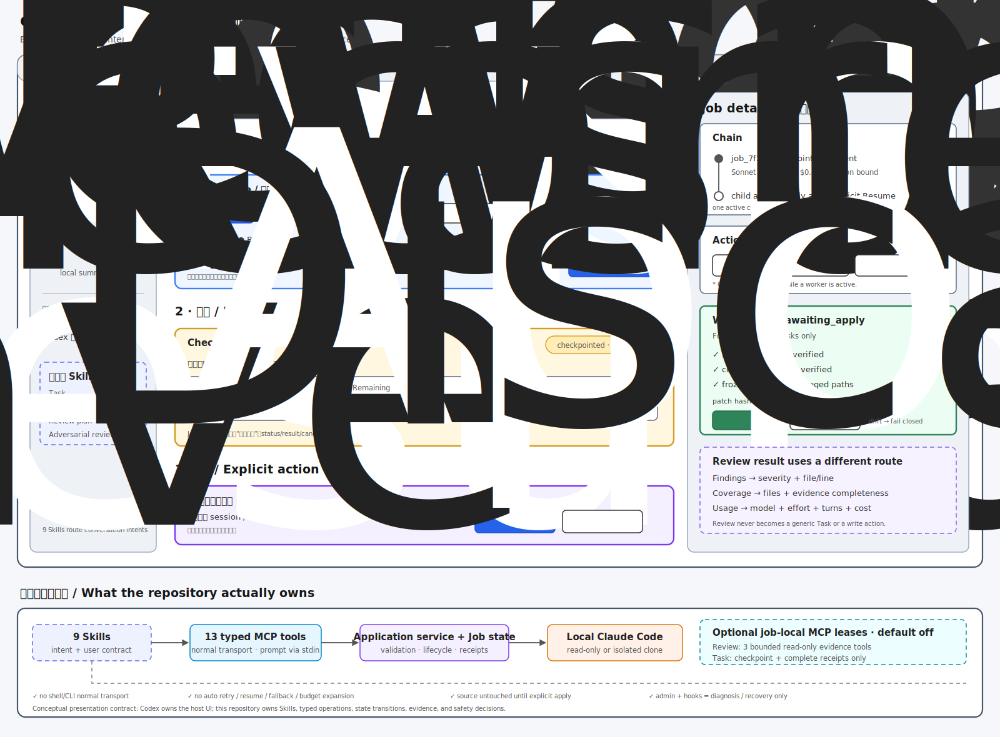

# cc-plugin-codex conversation-first Balsamiq prototype

**问题：** 当前仓库真正向用户提供的产品模型是什么，怎样用一张低保真图准确表达？

**深度：** Deep

**核心结论：** 这不是一个独立 dashboard，而是 Codex 对话中的三层工作流：发起 Intent、跟踪 Job、做显式决策。

**产物类型：** Supporting product storyboard；不是 Codex 原生 UI 合同或 Balsamiq 工程文件。

**验证状态：** 源码契约、九个 Skills、已安装 MCP probe 与 137 项仓库测试相互印证。

**开放问题：** Codex host 是否会提供插件自定义结果卡片或按钮 API；在此之前，图中的按钮表示信息和动作合同。

## First-principles product model

仓库控制的是意图路由、typed operations、Job 状态、证据与安全决策，不控制一个独立应用页面。因此默认产品表面应留在当前 Codex 对话中：

1. **发起 / Intent：** 明确选择 Task、code review、plan review 或 adversarial review。Task 再明确选择 read-only 或 isolated write，并展示 model、effort、profile、turn、budget 和 timeout。
2. **跟踪 / Job：** 每次后台执行都有明确 Job ID、状态、阶段、进度、model、usage、cost 和 parent/child chain；查询或取消不依赖隐式的“最近一次”。
3. **决策 / Explicit action：** checkpoint 只暴露 Resume 或保留；运行中的 Job 才能 Cancel；isolated write 完成并进入 `awaiting_apply` 后才暴露 Apply/Discard。

Jobs、Doctor 和 Transfer 是辅助入口。Doctor 只做只读 readiness 诊断，Transfer 只生成本地 summary seed；两者不应抢占主工作流。

## Evidence receipt

| 结论 | 当前仓库证据 |
|---|---|
| 插件表面由 Skills 与 MCP 构成 | `.codex-plugin/plugin.json:13`、`.codex-plugin/plugin.json:14` |
| 正常传输是 13 个 typed MCP operations | `mcp/server.mjs:13`、`mcp/server.mjs:29`、`mcp/server.mjs:45` |
| Task 与三种 Review 是不同应用操作 | `scripts/lib/service.mjs:21`、`scripts/lib/service.mjs:34`、`scripts/lib/service.mjs:43`、`scripts/lib/service.mjs:52` |
| isolated write 在独立 clone 中执行 | `scripts/lib/service.mjs:62`、`scripts/lib/service.mjs:71`、`scripts/lib/service.mjs:76` |
| 写入结果先冻结，之后才允许显式 apply/discard | `scripts/lib/patch-artifact.mjs:7`、`scripts/lib/patch-artifact.mjs:19`、`scripts/lib/patch-artifact.mjs:53` |
| apply 会检查 hash、重叠 drift、上下文 drift 与结果一致性 | `scripts/lib/patch-artifact.mjs:27`、`scripts/lib/patch-artifact.mjs:29`、`scripts/lib/patch-artifact.mjs:32`、`scripts/lib/patch-artifact.mjs:38` |
| Review Evidence Lease 只有三个有界只读工具 | `scripts/lib/review-evidence-contract.mjs:3`、`scripts/lib/review-evidence-contract.mjs:16` |
| Task Execution Lease 只有 checkpoint/complete receipts | `scripts/lib/task-execution-contract.mjs:3`、`scripts/lib/task-execution-contract.mjs:5` |
| Doctor 是只读 readiness 报告 | `scripts/lib/doctor-service.mjs:7` |
| admin CLI 只保留诊断和恢复命令 | `scripts/claude-admin.mjs:5` |

## State-to-action contract

| 当前状态 | 默认呈现 | 允许动作 |
|---|---|---|
| intent not started | 意图、capability、有效 runtime envelope | Start |
| starting / queued / running | Job ID、phase、progress、usage | Status、Result、Cancel |
| checkpointed | completed、remaining、verification、累计 cost | Resume、Leave saved；write checkpoint 也可 Discard |
| resuming | parent/child chain、same session/sandbox | Status、Result、Cancel；不出现第二个 Resume |
| completed read-only | output、usage、completion evidence | Result |
| completed write + `awaiting_apply` | changed paths、patch hash、sandbox/receipt evidence | Apply、Discard |
| drift / partial apply | 冲突或恢复证据 | fail closed、manual recovery guidance |

## Trust-boundary annotations

- `9 Skills → 13 typed MCP tools → application service / Job state → local Claude Code` 是主链路。
- 正常 Skill transport 不通过 shell/CLI；prompt 经 stdin 进入本地 Claude Code。
- Review Evidence Lease 与 Task Execution Lease 都是 job-local、default-off 的受限能力，不是主 UI。
- isolated write 的 source workspace 在显式 Apply 前保持不变。
- hooks 与 restricted admin CLI 只承担 lifecycle、diagnosis 和 recovery，不承担正常 Task/Review 路由。
- 不自动 retry、resume、fallback model 或扩张预算，避免第一次半途耗尽后第二次从头付费。

## Research closure

- **已确定：** conversation-first 的 Intent → Job → Decision 是唯一同时符合 Skills、MCP、service、持久状态和安全模型的信息架构。
- **最强反例：** Codex host 当前未必支持插件自定义 drawer 或原生按钮，所以这张图只能规定信息层级与动作条件，不能声称仓库已经提供该页面。
- **推翻条件：** 如果 Codex 发布允许插件拥有独立页面和持久导航的正式扩展 API，应重新评估是否将 Jobs/Doctor 升级为独立操作界面。
- **停止原因：** 静态代码、Skills 契约、已安装 MCP 的 13-tool probe 和 137/137 tests 对核心模型给出一致证据，继续搜索不会改变当前设计选择。

Task Execution Lease 的文字级交互说明保留在
[`task-execution-lease-low-fidelity.md`](task-execution-lease-low-fidelity.md)；不再维护单独的下钻 SVG。
